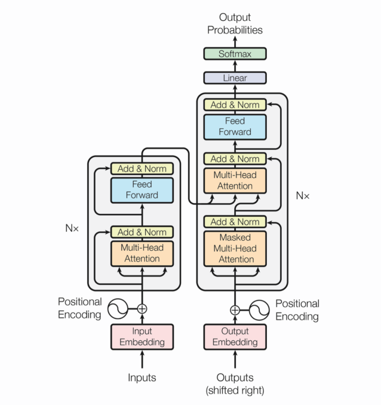

## 词嵌入
- 词的表示方式: 词映射到语义空间中的一个点(词向量)
- one-hot向量
    - 优点: 简单
    - 缺点
        - 相同的词距离为0,不同的距离为1
        - 高维的稀疏向量
- 语言模型: 词向量只是一个副产品, 且训练速度慢
    - 评价指标: 困惑度
    - 基于统计的N-Gram语言模型: 平滑方法
        - 缺点
            - N不能太大, 无法考虑长距离依赖
            - 基于词的共现, 泛化能力差
    - 神经网络
        - 特征映射: 嵌入矩阵
        - 条件概率分布: 神经网络
- Distributional表示: 两个词的上下文相似,那么这两个词的语义就相似
    - Word2Vec: 一个词的语义可以由它的上下文确定 
        - Continuous Bag-of-Word: 用一个词的上下文来预测这个词
        - Skip-Gram: 一个词来预测它的上下文
        - 加速方法
            - Hierarchical Softmax: Huffman树
            - Negative Sampling: 采样一部分计算
    - [Chinese-Word-Vectors](https://github.com/Embedding/Chinese-Word-Vectors)
## RNN
- RNN: 记忆能力, 顺序依赖,无法并行
    - 隐状态
    - 参数共享
    - 每一时刻都有输出
- LSTM/GRU: 解决长距离依赖问题
    - 门机制
- Seq2Seq: 两个RNN, Encoder和Decoder, 定长的context向量
    - Attention: 翻译某个词时注意相关词
## Transformer
- 问题
    - RNN不能考虑整句
    - Attention需要外部驱动
- Transformer : 并行性好
    - Postion encoding : 三角函数能够表达相对位置(加法公式)
    - Multi-Heads: 平均分配特征维长度
        - Self-Attention: 查询Q 键值对(K, V)
        - Mask: 乘一个足够大的负数后再softmax结果足够小
            - Padding Mask: 忽略填充
            - Sequence Mask: 隐藏t时刻后信息
        - Add & LayerNorm
## Contextual Word Embedding
- 问题
    - Word Embedding无上下文
    - 监督数据太少
- Contextual Word Embedding
    - 无监督
    - 考虑上下文的Embedding
- ELMo: 多层双向的LSTM的神经网络语言模型
    - Contextual Word Embedding作为特征
    - 不适合特定任务
- OpenAI GPT: 没有Encoder的Transformer, 根据具体任务Fine-Tuning
    - 单向
    - Pretrainng和Fine-Tuning不匹配
- Bert: 数据量越多效果越好?
    - Masked LM : 随机Mask掉15%的词
    - Multi-Task Learning: 预测下一个句子任务 
    - Fine-Tuning
- ERNIE: 学习语义知识
- XLNET: 通过输入序列的各种排列，同时学习到上下文的信息
    - 语言模型 vs Bert
        - 独立假设
        - 输入噪声
        - 双向上下文
    - 排列语言模型
        - Two-Stream
    - Transformer-XL: Segment基本的状态重用, 不需要定长