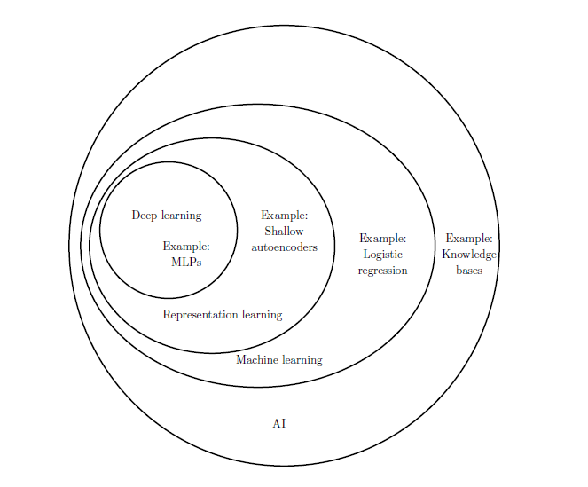

Refer to Hands-on Machine Learning with Scikit-Learn & TensorFlow Aurelien Geron

## 人工智能(AI)

- 人工智能：机器表现出来的智能
    - 机器学习：计算机程序利用经验E学习任务T，性能是P，针对任务T的性能P随着经验E不断增长(让计算机具有学习的能力)
        - 深度学习：深度神经网络
---
## 机器学习
- 机器学习
    - 擅长
        - 需要进行大量手工调整或需要拥有长串规则才能解决的问题
        - 问题复杂，传统方法难以解决
        - 环境有波动
        - 洞察复杂问题和大量数据
    - 挑战
        - 训练数据量不足
        - 没有代表性的训练数据：样本偏差
        - 低质量数据：数据清洗
        - 不相关特征：特征工程
        - 过拟合训练数据
            - 简化模型
                - 正则化：超参数
            - 收集更多训练数据
            - 减少训练数据的噪声
        - 欠拟合训练数据
            - 更强大的模型
            - 更好的特征
            - 减少限制

- 机器学习分类
    - 是否在人类监督下进行训练
        - 监督
            - 分类
            - 回归
        - 非监督
            - 聚类
            - 可视化和降维
            - 异常检测
            - 关联性规则学习
        - 半监督 
            - 深度信念网络(DBN)：受限玻尔兹曼机
        - 强化学习：`Get reward or penalty`
            - 模拟环境：`OpenAI`
            - 马尔可夫决策过程
            - Q学习
    - 是否可以动态学习
        - 批量学习：使用所有可能数据进行训练
        - 在线学习
            - 学习速率
            - 性能监测
    - 简单比较数据或在训练数据中建立预测模型
        - 基于实例学习：记忆+相似度
        - 基于模型学习

## 一个完整的机器学习项目
- 明确问题、心怀愿景
    - 定义(商业)目标
    - 你的结果将会被怎么使用？
    - 当前的解决方法是什么？
    - 怎样划定这个问题(监督/非监督，在线/离线)？
    - 性能指标是什么？
    - 性能指标和(商业)目标一致吗？
    - 达到(商业)目标需要的最低性能指标是多少？
    - 有相关的问题吗？有可用的经验或工具吗？
    - 列出你和其他人所做的假设
    - 尽量核实假设
- 获取数据：尽量自动化，更好地获得新鲜数据
    - 列出你所需的数据以及数据量
    - 找到可以得到数据的地方
    - 预测数据占用的空间大小
    - 注意法律风险，如果需要，获得授权。
    - 接入API
    - 创建足够大的工作空间
    - 在不改变数据的情况下，转换数据为容易操作的类型
    - 确保敏感数据被删除或被保护(匿名)
    - 检查数据的大小和类型(时间序列，抽样数据，地理数据)
    - 取样出测试集，放在一边。
- 探究数据：咨询领域专家获得洞察力
    - 创建数据副本(若有需要，可以取样出合适的大小)
    - 用Jupyter notebook记录数据探究的过程
    - 研究每个特征及其特点
        - 名字
        - 类型(类别，数值，文本，结构化)
        - 缺失数据的百分比
        - 噪声及其类型(随机，异常值，舍入误差)
        - 可能对任务有用的特征？
        - 分布的种类(高斯，均匀，对数)
    - 对监督学习，指出目标特征
    - 可视化数据
    - 研究属性之间的关联
    - 想一想你会怎样手动解决这个问题
    - 找出你想要采用的有希望的数据变换
    - 是否需要额外数据(转到获取数据步骤)
    - 记录你所学到的知识，整理成文档
- 准备数据：在副本上进行，对数据变换编写函数
    - 数据清洗
        - 修正或移除异常值(可选)
        - 填充缺失值(0,均值，中位数)或删除所在列(行)
    - 特征选择(可选)
        - 删除对任务没有用的特征
    - 在合适的时机进行特征工程
        - 离散连续特征
        - 分解特征(类别，日期/时间)
        - 添加有希望的新特征(x^2,log(x))
        - 组合特征为新特征
    - 特征缩放：归一化或标准化
- 列出有希望的模型：取样数据使有合理的训练时间(牺牲复杂的模型)，尽量自动化
    - 快速使用默认参数训练多个粗糙的模型(线性，朴素贝叶斯，神经网络)
        - 测量和比较它们的性能
            - 采用交叉验证查看均值和方差
        - 对每个算法分析最重要的参数
        - 分析模型所犯的错误类型
            - 人类会用什么数据避免这些错误
        - 快速的特征选择和特征工程
        - 对前几步进行几次迭代
        - 列出最有希望的三到五个模型，最好错误类型不相同
    - 微调系统：尽量使用最多的数据，尽量自动化
        - 用网格搜索微调超参数
            - 将数据变换看成超参数(当你不确定时)
            - 采用随机网格搜索(除非超参数很少)
        - 尝试集成方法
        - 当你对最终模型有信心时，在测试集上估计泛化误差
    - 展示你的方法
        - 整理成文档
        - 准备良好的展示
            - 突出你的愿景
        - 解释你的方法为什么完成了(商业)目标
        - 展示在解决问题过程中有趣的点
            - 描述起作用和没起作用的方法
            - 列出你的假设和系统限制
        - 漂亮的可视化或简洁的陈述展示关键点
    - 部署
        - 为生产环境准备模型(接入生产数据，编写单元测试)
        - 编写监控代码评估你的系统的实时表现，在性能下降时预警
            - 当数据进化时，模型会逐渐腐烂
            - 可能需要人类流水线(通过外包服务)
            - 同时监控系统的输入质量
        - 在合理的新鲜数据上重新训练(尽量自动化)

## 常用算法
- 监督学习
    - K近邻算法
    - 线性回归
    - 逻辑回归
    - 支持向量机
    - 朴素贝叶斯
    - 决策树和随机森林
        - 熵
    - 集成学习和随机森林
        - bagging
        - boosting
        - stacking
    - 神经网络
- 非监督
    - 聚类
        - K均值
        - 层次聚类分析
        - 期望最大值
    - 可视化和降维
        - 主成分分析(PCA)
        - t-分布邻域嵌入算法(t-SNE)
    - 关联性规则学习
        - Apriori
        - Eclat

## 深度学习
- 兴起原因
    - 大量数据
    - 计算能力
    - 改进算法
    - 接近全局最优
    - 良性循环
- 感知器
    - 神经元的逻辑运算
- 深度学习(DNN): 两个或多个隐含层的多层感知器
    - 基本训练方法
        - 反向传播
            - 预测(向前)，测量误差
            - 反向遍历每个连接的误差贡献
            - 微调连接器权值减少误差
        - 激活函数
            - logistic函数
            - 双曲正切函数
            - Relu函数
        - 隐藏层
            - 隐藏层数量：分层结构(重用神经网络)
            - 每层的神经元数量：`黑色艺术`
                - 早期停止
                - drop out
    - 进阶
        - 问题：梯度消失/爆炸
            - 初始化策略(不同的激活函数): logistic$\rightarrow$Xavier
            - 非饱和激活函数：ELU
            - 批量标准化(BN)
            - 梯度裁剪
        - 预训练
            - 无监督预训练(RBM)
            - **自编码器**
            - 在辅助任务上预训练
        - 复用预训练层：`Models Zoos`
            - 冻结较低层
            - 缓存冻结层
            - 调整、删除和替换较高层
        - 更快的优化器
            - 动量优化
            - Nesterov加速梯度
            - AdaGrad
            - RMSProp
            - **Adam优化**
        - 学习率调整
        - 正则化避免过拟合
            - 早期停止
            - L1和L2正则化
            - Dropout
            - 最大范数正则化
            - 数据增强

## 常见神经网络
- 卷积神经网络(CNN)：图像
    - 基础
        - 卷积层：`convolution`
            - 卷积核/过滤器: `padding`
            - 叠加的多个特征映射
            - 内存需求
        - 池化层：`pooling`
            - Max pooling
    - CNN架构
        - LeNet-5
        - AlexNet
        - GoogleNet
        - ResNet
    - 应用：计算机视觉

- 循环神经网络(RNN)：时间序列
    - 基本概念
        - 循环神经元
        - 记忆单元
        - 输入和输出序列
    - 训练RNN：`BPTT`
        - 训练序列分类器
        - 截断时间反向传播
            - LSTM单元
        - 生成RNN
        - 深度RNN
    - 应用
        - 自然语言处理