## 绪论
- 人工智能:让机器的行为和人所表现的智能行为一样
    - 领域
        - 感知:计算机视觉,语音信息处理
        - 学习:模式识别,机器学习,强化学习
        - 认知:知识表示,自然语言处理,规划,决策
    - 发展历史:
        - 推理期:基于逻辑或事实归纳出规则,编写程序完成任务
        - 知识期:专家系统(知识库+推理机)
        - 学习期:机器学习
    - 流派:关注融合,建立高效且可解释的模型
        - 符号主义:信息用符号表示+符号通过显式的规则(逻辑)操作
        - 连接主义:大量简单神经元构成的神经网络处理信息
- 神经网络
    - 大脑神经网络:全球的计算机网络,和大脑神经网络相比要“简单”得多
    - 人工神经网络:模拟人脑神经网络而设计的数据模型或计算模型
    - 发展历史:
        - 模型提出:感知器
        - 冰河期:不能解决线性不可分问题(XOR)+计算能力不足
        - 反向传播算法引起的复兴
        - 流行度降低:支持向量机(SVM)等跟简单的方法
        - 深度学习的崛起:数据规模增大+并行计算(GPU)
- 表示学习:语义鸿沟(Semantic GAP)
    - 什么是好的表示
        - 局部表示:高维稀疏向量,无法判断相似度
        - 分布式表示:低维稠密向量 容易判断相似度
    - 怎么学习到好的表示
        - 传统机器学习:特征工程,人为设计一些准则,与最终预测模型的学习分开
            - 传统特征选择和特征抽取方法 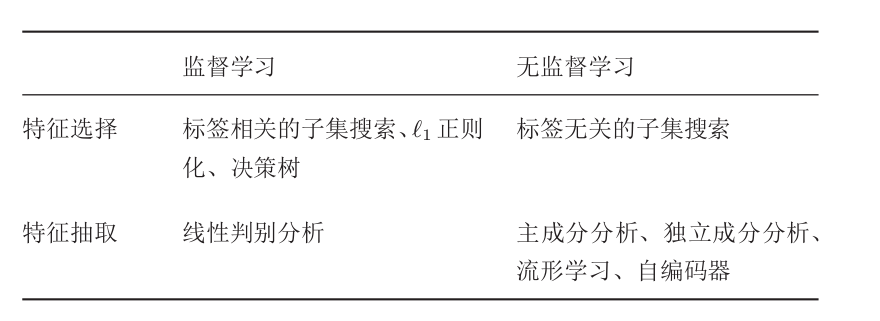
        - 深度学习:深层结构的优点是可以增加特征的重用性,从而指数级地增加表示能力
- 深度学习:模型复杂,经过多个线性或非线性组件 
    - 人工神经网络(ANN):解决贡献度分配问题(CAP)
        - 端到端学习:学习过程中不进行分模块或分阶段进行训练,直接优化任务的总体目标
        - 常用框架:
            - TensorFlow:数据流图
                - 高级模块: Keras
            - PyTorch:动态计算图
    - 概率图模型 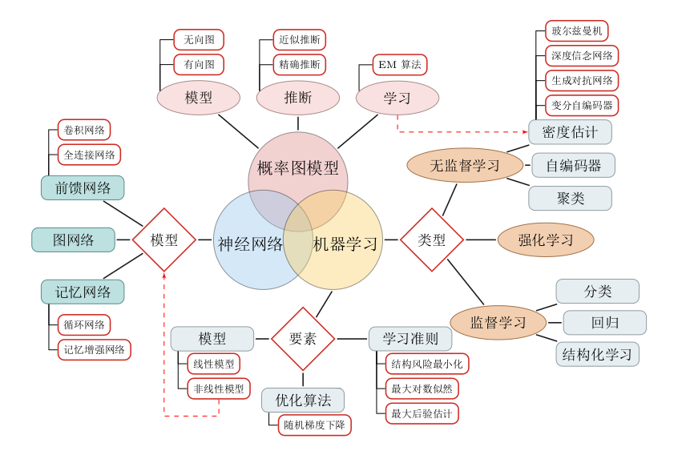

## 机器学习概述
- 基本概念: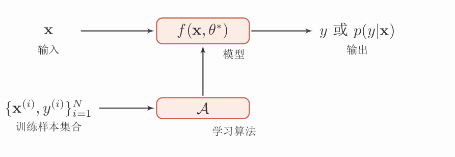
- 三个基本要素:
    - 模型:从假设空间选择一个理想的假设
        - 线性模型:$f(x,\theta) = w^Tx+b$
        - 非线性模型:$f(x, \theta) = h(w^Tx+b)$
    - 学习准则:基本假设 样本分布固定,样本独立地随机产生
        - 损失函数
            - 0-1损失:错误率,数学性质差
            - 平方损失(回归)
            - 交叉熵损失(分类):衡量两个概率分布的差异
            - Hinge损失(二分类):间距最大化(SVM)
        - 风险最小化准则
            - 期望风险:需要知道真实数据分布
            - 经验风险:平均损失
                - 结构风险:正则化(假设参数的先验分布)
    - 优化算法:最优参数和超参数
        - 正规方程
        - 梯度下降法:提前停止
            - 随机:目标函数非凸,可以逃离局部最优点
            - 批量:可以利用计算机的并行计算能力
- 评价指标
    - 分类:正确率,准确率,召回率,F1值,AUC
- 理论和定理
    - 计算学习理论:分析问题难度、计算模型能力,为学习算法提供理论保证,并指导机器学习模型和学习算法的设计
        - 可能近似正确(PAC)学习理论:分析一个机器学习方法在什么条件下可以学习到一个近似正确的分类器
    - 没有免费午餐定理(NFL):对于基于迭代的最优化算法,不存在某种算法对所有问题(有限的搜索空间内)都有效
    - 丑小鸭定理:世界上不存在相似性的客观标准,一切相似性的标准都是主观的
    - 奥卡姆剃刀:如无必要,勿增实体
    - 归纳偏置(先验):对学习问题做一些假设
- 偏差-方差分解:期望错误=样本分布以及噪声+偏差平方+方差
- 特征表示
    - 图像特征
    - 文本特征:词袋模型(BoW)
- 线性模型 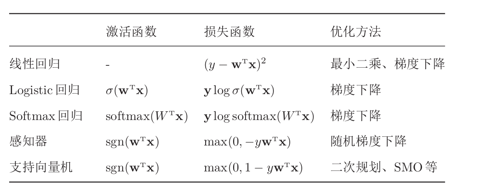

## 前馈神经网络
- 神经元:接受一组输入信号并产出输出
    - 净输入(Net Input): $z=w^Tx+b$
    - 活性值(Activation): $a=f(z)$
        - 激活函数:连续可导的非线性函数,尽可能简单,导函数的值域在一个合适区间
            - Sigmoid型激活函数:两端饱和函数 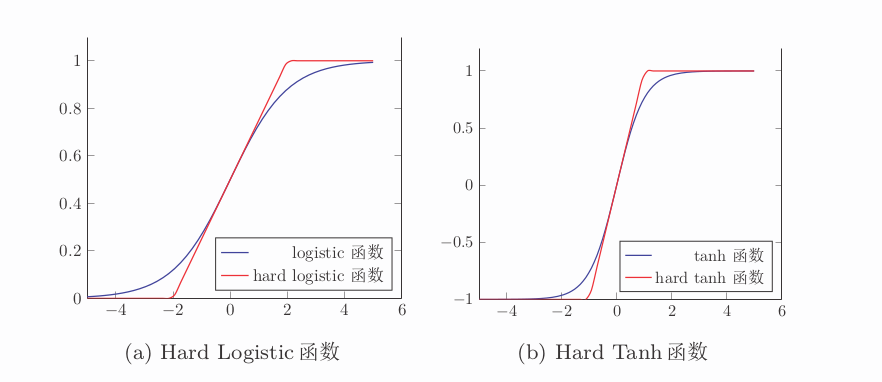
                - Logistic函数:输出可直接看成概率分布
                - Tanh函数:零中心化
                - Hard-Logistic和Hard-Tanh函数:分段线性
            - 修正线性单元(ReLU):计算高效,加速梯度下降的收敛速度,但非中心化 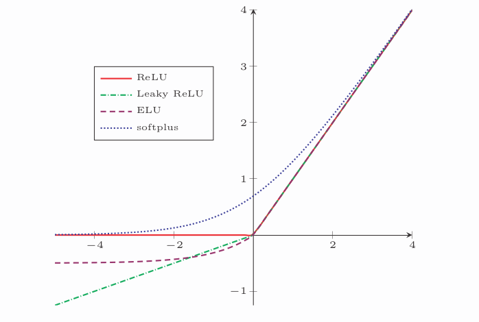
                - Leaky ReLU:避免永远不能被激活
                - 带参数的ReLU:可学习的参数
                - ELU:近似的零中心化的非线性函数
                - Softplus:平滑版本,无稀疏激活性
            - Swish函数:线性函数和ReLU函数之间的非线性插值 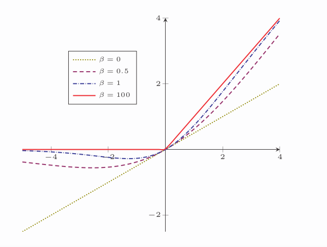
            - Maxout单元:整体学习输入到输出的非线性映射关系
- 网络结构
    - 前馈网络(FNN):每一层中的神经元接受前一层神经元的输出,并输出到下一层神经元(复合函数) 
        - 通用近似定理:含有一个隐藏层的前馈网络可以任何逼近Borel可测函数(过拟合)
    - 反馈网络:不但可以接收其它神经元的信号,也可以接收自己的反馈信号(记忆功能)
        - 循环神经网络
        - Hopfield
        - 波尔兹曼机
    - 图网络
- 反向传播算法
    - 前馈计算每一层的净输入和激活值,直到最后一层
    - 反向传播计算每一层的误差项$\delta^{(l)}=f'_l(z^{(l)})(W^{(l+1)})^T\delta^{(l+1)}$ 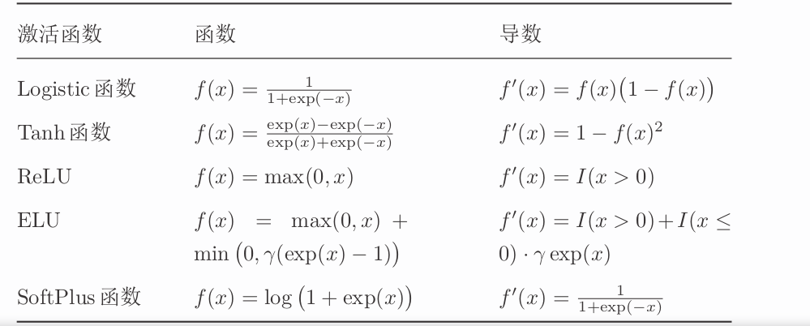
    - 计算每一层参数的偏导数,并更新参数
- 自动梯度计算:手动求导并转换为计算机程序的过程非常琐碎并容易出错
    - 数值微分:难以找到合适的扰动,计算复杂度高
    - 符号微分:处理带有变量的数学表达式,编译时间长,表示数学表达式,很难对程序进行调试
    - 自动微分:分解为基本操作,再利用链式法则(计算图)
        - 动态计算图:灵活性高,但不容易优化,当不同网络结构不一致时,难以并行计算
        - 静态计算图:在构建时可以进行优化,并行能力强,但灵活性差
- 优化问题
    - 非凸优化问题
    - 梯度消失问题
## 卷积神经网络
- 全连接前馈网络问题
    - 参数太多
    - 局部不变性特征
- 卷积:在一个图像(或某种特征)上滑动一个卷积核(滤波器),通过卷积操作得到一组新的特征
    - 卷积的变种
        - 步长(Stride)
        - 零填充(Zero Padding)
    - 数学性质
        - 交换性
        - 导数性质
- 卷积神经网络
    - 卷积代替全连接 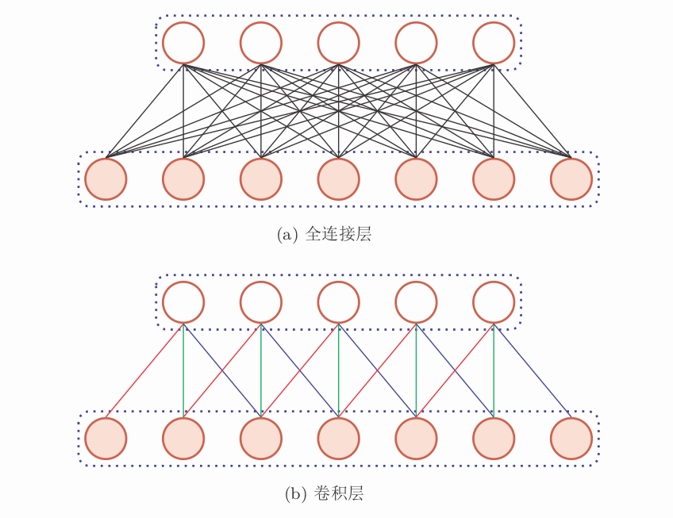
        - 局部连接
        - 权重共享
    - 卷积层:三维结构的神经层 
    - 汇聚(Pooling)层:进行特征选择,减少参数数量
        - Maximum Pooling
        - Mean Pooling
- 参数学习
    - 误差项的计算
        - 汇聚层
        - 卷积层
- 几种典型的卷积神经网络
    - LeNet-5 
        - 连接表:输入和输出特征映射之间的连接关系
    - AlexNet 
    - Inception: GoogLeNet
    - ResNet:非线性的卷积层增加直连边的方式来提高信息的传播效率 
- 其它卷积方式
    - 转置卷积:低维特征映射到高维特征
        - 微步卷积:步长小于1的转置卷积
    - 空洞卷积:不增加参数数量,同时增加输出单元感受野的一种方法
## 循环神经网络
- 给网络增加记忆能力
    - 延时神经网络:非输出层添加延时器,记录最近几次神经元的输出
    - 有外部输入的非线性自回归模型:通过延时器记录最近几次的外部输入和输出
    - 循环神经网络(RNN):带有自反馈的神经元
- 简单循环网络(SRN):只有一个隐藏层的循环神经网络
    - 循环神经网络的计算能力:可以模拟任何程序
        - 通用近似定理:近似任何一个非线性动力系统
        - 图灵完备:数据操作规则,可以实现图灵机的所有功能,解决所有的可计算问题
- 应用到机器学习
    - 序列到类别模式:文本分类 
    - 同步的序列到序列模式:词性标注 
    - 异步的序列到序列模式(Encoder-Decoder):机器翻译 
- 参数学习
    - 随时间反向传播算法(BPTT):按时间展开的多层前馈网络
    - 实时循环学习算法(RTRL):通过前向传播的方式来计算梯度
    - 比较:BPTT计算量更小.而RTRL空间复杂度低
- 长期依赖问题:梯度爆炸或梯度消失
    - 改进方案
        - 梯度爆炸:权重衰减或梯度截断
        - 梯度消失:外部记忆或选择性遗忘以及选择性更新
- 基于门控的循环神经网络
    - 长短期记忆网络(LSTM)
        - 新的内部状态:线性的循环信息传递,同时非线性输出信息
        - 门机制:遗忘门,输入门,输出门 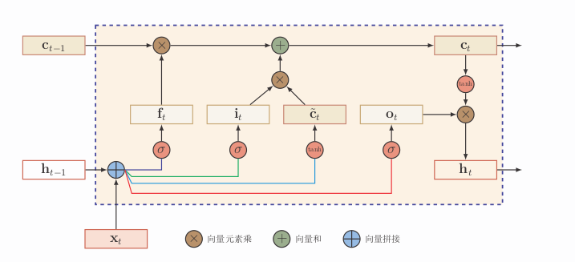
        - 记忆:记忆单元中保存信息的生命周期要长于短期记忆,但又远远短于长期记忆
    - LSTM的各种变体
        - 无遗忘门的LSTM网络
        - peephole连接
        - 耦合输入门和遗忘门
    - 门控循环单元网络(GRU):比LSTM网络更加简单的循环神经网络 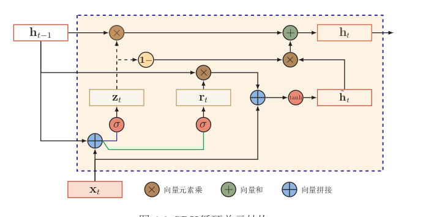
        - 输入门和遗忘门合并为更新门
        - 不需要记忆单元,直接引入线性依赖关系
- 深层循环神经网络
    - 堆叠循环神经网络(SRNN) 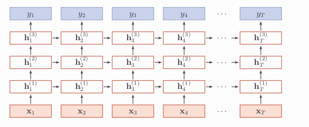
    - 双向循环神经网络(Bi-RNN) 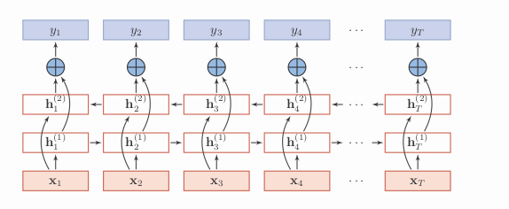
- 扩展到图结构:隐状态看做一个节点,构成一个链式结构
    - 递归神经网络:有向无环图上的图网络
    - 图网络
## 网络优化与正则化
- 网络优化
    - 难点
        - 网络结构的多样性
        - 高维变量的非凸优化
        - 平坦底部:参数带有冗余性,这导致每单个参数对最终损失的影响都比较小
    - 优化算法 
        - 小批量梯度下降
        - 学习率衰减 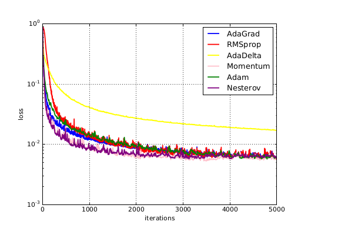
            - AdaGrad算法
            - RMSprop算法
            - AdaDelta算法
        - 梯度方向优化
            - 动量法:用梯度的移动平均来代替每次的实际梯度
            - Nesterov加速梯度
            - Adam算法:动量法+RMSprop
            - 梯度截断
                - 按值截断
                - 按模截断
    - 参数初始化
        - Gaussian分布初始化
        - 均匀分布初始化
            - Xavier初始化方法
    - 数据预处理
        - 缩放归一化
        - 标准归一化
        - 白化:降低输入数据特征之间的冗余性, PCA
    - 逐层归一化:协变量偏移
        - 批量归一化(BN):对一个中间层的单个神经元进行归一化操作
        - 层归一化:对一个中间层的所有神经元进行归一化
            - 循环神经网络
        - 其他
            - 权重归一化
            - 局部响应归一化:CNN
    - 超参数优化
        - 网格搜索
        - 随机搜索
        - 贝叶斯优化
            - 时序模型优化
        - 动态资源分配
            - 逐次减半
        - 神经架构搜索
    - 网络正则化
        - L1和L2正则化
        - 权重衰减
        - 提前停止
        - 丢弃法:随机丢弃一部分神经元(同时丢弃其对应的连接边)来避免过拟合
            - 解释
                - 集成学习的解释
                - 贝叶斯学习的解释
            - RNN
                - 对非时间维度的连接进行随机丢失
                - 变分丢弃法:参数矩阵的每个元素进行随机丢弃,并在所有时都使用相同的丢弃掩码
        - 数据增强:增加数据量,提高模型鲁棒性,避免过拟合(图像)
        - 标签平滑:输出标签中添加噪声来避免模型过拟合
## 注意力机制和外部记忆
- 注意力:将计算资源分配给更重要的任务
    - 认知神经学中的注意力
        - 聚焦式注意力:有预定目的、依赖任务的、主动有意识地聚焦于某一对象的注意力
        - 显著性注意力:外界刺激驱动的注意,不需要主动干预,也和任务无关
    - 人工神经网络中的注意力机制
        - 注意力分布:给定任务相关的查询向量和输入序列后,选择第i个输入信息的概率
            - 加性模型:简单
            - 点积模型:可以利用矩阵乘法,计算效率高
            - 缩放点积模型:解决softmax函数的梯度较小问题
            - 双线性模型:引入非对称性
        - 加法平均:软性注意力机制
    - 注意力机制的变体 
        - 硬性注意力:只关注某一个位置上的信息,无法利用反向传播算法(不可导)
            - 选取最高概率的输入信息
            - 注意力分布上随机采样的方式
        - 键值对注意力:键计算注意力分布,值计算聚合信息
        - 多头注意力:利用多个查询,平行地计算从输入信息中选取多个信息
        - 结构化注意力:使用层次化的注意力来进行更好的信息选择
- 注意力机制的应用
    - 指针网络:输入一组乱序的数字,输出为按大小排序的输入数字序列的下标
    - 自注意力模型:利用注意力机制来“动态”地生成不同连接的权重,解决长距离依赖问题
        - 忽略了输入信息的位置信息,可以加入位置编码进行修正
- 外部记忆
    - 人脑中的记忆 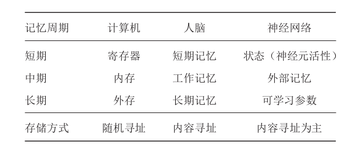
    - 结构化的外部记忆 
        - 实现联想记忆:注意力机制
    - 典型的记忆网络
        - 端到端记忆网络:可微的网络结构,可以多次从外部记忆中读取信息,外部记忆单元是只读的 
        - 神经图灵机: 外部记忆是可以可读写的 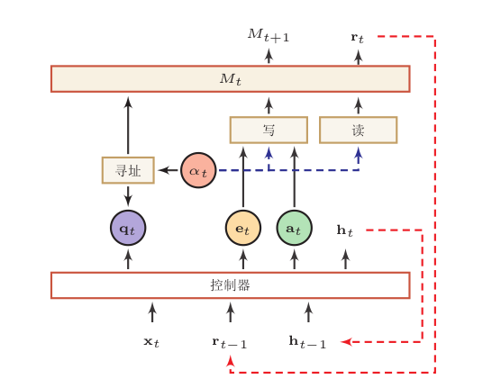
    - 基于神经动力学的联想记忆:通过神经网络的动态演化来进行联想
        - Hopfield网络:作为一种记忆的存储和检索模型,所有神经元都相互连接的不分层的神经网络
        - 使用联想记忆增加网络容量
## 无监督学习
- 概述
    - 分类
        - 无监督特征学习
        - 密度估计
        - 聚类
    - 准则
        - 最大似然估计
        - 最大重构错误
- 无监督特征学习
    - 主成分分析(PCA):在转换后的空间中数据的方差最大
        - 不能提高类别可分性,可以考虑线性判别分析(LDA)
    - 稀疏编码:每个神经元仅对处于其感受野中特定的刺激信号做出响应
        - 训练方法:交替优化
        - 优点
            - 计算量小
            - 可解释性
            - 特征选择
    - 自编码器:通过无监督的方式来学习一组数据的有效编码(或表示) 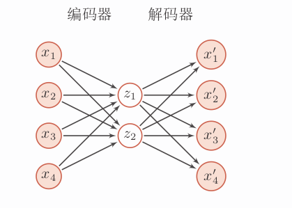
    - 稀疏自编码器
    - 堆叠自编码器
    - 降噪自编码器:引入噪声来学习更鲁棒性的数据编码,并提高模型的泛化能力
- 概率密度估计
    - 参数密度估计:先验知识假设随机变量服从某种分布,然后通过训练样本来估计分布的参数
        - 常用分布
            - 正态分布
            - 多项分布
        - 问题
            - 模型选择问题
            - 不可观测变量问题
            - 维数灾难问题
    - 非参数密度估计:通过将样本空间划分为不同的区域并估计每个区域的概率来近似数据的概率密度函数
        - 固定区域大小,统计落入不同区域的数量:直方图和核方法
        - 改变区域大小以使得落入每个区域的样本数量相同:K-近邻方法
## 模型独立的学习方式
- 集成学习
    - Bagging
        - 随机森林
    - Boosting
        - AdaBoost
- 自训练和协同训练:半监督学习
    - 自训练:使用标注数据来训练一个模型,并使用这个模型来预测无标注样本的标签,把预测置信度比较高的样本及其预测的伪标签加入训练集,然后重新训练新的模型
    - 协同训练:通过两个基于不同视角(view)的分类器来相互促进
- 多任务学习:同时学习多个相关任务,让这些任务在学习过程中共享知识,利用多任务之间的相关性来改进模型在每个任务的性能和泛化能力
    - 共享机制 
    - 学习步骤
        - 联合训练阶段
        - 单任务精调阶段
- 迁移学习:将相关任务的训练数据中的可泛化知识迁移到目标任务上
    - 归纳迁移学习:源领域和目标领域有相同的输入空间
        - 迁移方式
            - 基于特征的方法
            - 精调的方法
    - 推导迁移学习:一般假设源领域和目标领域有相同的样本空间,但是数据分布不同
        - 协变量偏移
        - 概念偏移
        - 先验偏移
- 终身学习:具有持续不断的学习能力,根据历史任务中学到的经验和知识,来帮助学习不断出现的新任务
    - 灾难性遗忘
        - 弹性权重巩固:Fisher信息矩阵
- 元学习(学习的学习):已有任务中学习一种学习方法或元知识,可以加速新任务的学习
    - 基于优化器的元学习:自动学习一种更新参数的规则,即通过另一个神经网络来建模梯度下降的过程
    - 模型无关的元学习:在任务空间的所有任务上学习一种通用的表示,这种表示可以经过梯度下降方法在一个特定的单任务上进行精调
## 概率图模型
- 基本问题  
    - 模型表示:对于一个概率模型,如何通过图结构来描述变量之间的依赖关系
    - 推断:在已知部分变量时,计算其它变量的后验概率分布
        - 近似推断
    - 学习:图模型的学习包括图结构的学习和参数的学习
- 深度信念网络:有效学习变量之间复杂依赖关系
    - 波尔兹曼机:每个变量的状态都以一定的概率受到其它变量的影响,概率无向图
        - 生成模型
        - 能量最小化与模拟退火
        - 参数学习
    - 受限制波尔兹曼机:二分结构的无向图模型
    - 深度信念网络: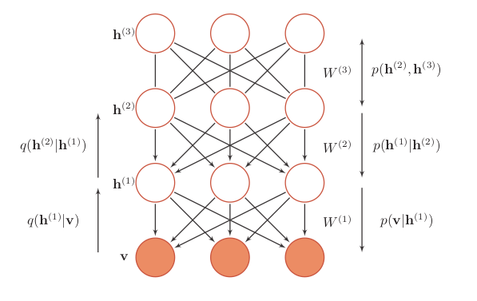
- 深度生成模型:利用深层神经网络可以近似任意函数的能力来建模一个复杂的分布
    - 概率生成模型
        - 密度估计
        - 生成样本
    - 变分自编码器 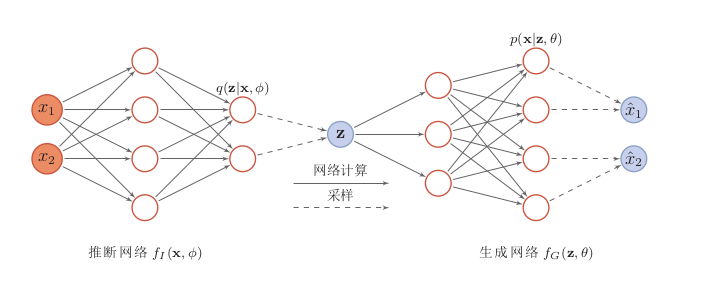
        - 含隐变量的生成模型
        - 推导网络
        - 生成网络
        - 模型汇总
        - 训练
    - 生成对抗网络
        - 显式密度模型和隐式密度模型:是否估计出数据分布的密度函数
        - 网络分解 
            - 生成对抗网络(GAN):对抗训练的方式来使得生成网络产生的样本服从真实数据分布
        - 训练
        - 具体实现:DCGAN
        - 模型分析
        - 改进模型
- 序列生成模型
    - 序列概率模型(自回归模型)
        - 序列生成
            - 束搜索(Beam Search) 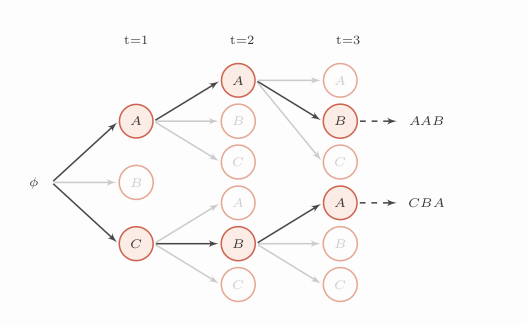
    - N元统计模型:每个词只依赖其前面的N-1个词
        - 一元模型
        - N元模型
        - 平滑技术:数据稀疏问题
    - 深度序列模型:利用神经网络模型来估计条件概率
        - 嵌入层
        - 特征层
            - 简单平均
            - 前馈神经网络 
            - 循环神经网络 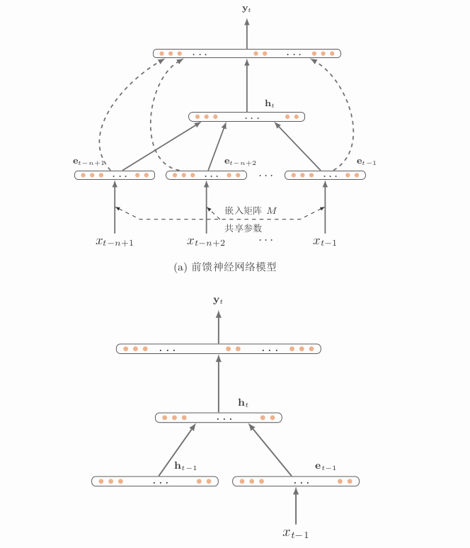
        - 参数学习:梯度上升
    - 评价方法
        - 困惑度(Perplexity):衡量两个分布之间差异
        - BLEU:模型生成序列和参考序列之间的N元词组(N-Gram)的重合度
        - ROUGE:计算召回率
    - 序列生成模型中的学习问题
        - 曝光偏差问题:一旦预测前缀的过程中存在错误,会导致错误传播,使得后续生成的序列也会偏离真实分布
            - 计划采样:训练时混合使用真实数据和模型生成数据
        - 训练目标不一致问题:采用和任务相关的指标来进行评价,而训练时是使用最大似然估计
            - 基于强化学习的序列生成
        - 计算效率问题:输出层为词表中所有词的条件概率,需要Softmax归一化。当词表比较大时,计算效率比较低
            - 层次化Softmax:层次化树(Huffman树,平衡树)
            - 重要性采样
            - 噪声对比估计:密度估计问题转换为两类分类问题
    - 序列到序列模型
        - 基于RNN的序列到序列模型
            - 编码器
            - 解码器
        - 基于注意力的序列到序列模型
        - 基于自注意力的序列到序列模型
            - Transformer 
## 深度强化学习
- 强化学习问题
    - 典型例子
        - 多臂赌博机问题
        - 悬崖行走问题
    - 定义
        - 智能体:感知外界环境的状态(state)和反馈的奖励(reward),并进行学习和决策
        - 环境:智能体外部的所有事物,并受智能体动作的影响而改变其状态,并反馈给智能体相应的奖励
    - 马儿可夫决策过程:
    - 目标函数
        - 总回报
        - 目标函数:最大化期望回报
    - 值函数:对策略π的评估
        - 状态值函数:表示从状态s开始,执行策略π得到的期望总回报
        - 状态-动作函数(Q-function):初始状态为s并进行动作a,然后执行策略π得到的期望总回报
    - 深度强化学习:强化学习来定义问题和优化目标,用深度学习来解决策略和值函数的建模问题,然后使用误差反向传播算法来优化目标函数
- 基于值函数的学习方法
    - 动态规划算法
    - 蒙特卡罗方法
    - 时序差分学习方法
    - 深度Q网络(DQN)
- 基于策略函数的学习方法
    - REINFORCE算法
    - 带基准线的REINFORCE算法
- Actor-Critic算法  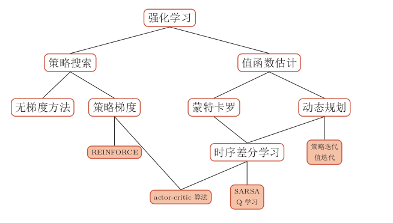
