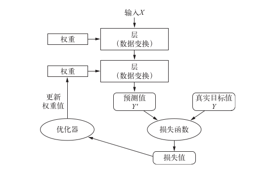

## Keras
- 加载数据集
- 数据预处理
    - 准备标签
- 网络架构
- 编译步骤 
    - 损失函数
    - 优化器:RMSProp
    - 训练和测试过程中需要的监控的指标(metric)
- 拟合
- 评估在测试集上的性能

- 数据表示
    - 轴的个数:`ndim`
    - 形状:`shape`
    - 数据类型:`float32`
- 张量运算
    - 逐元素运算
    - 广播
    - 张量点积
    - 张量变形
## 神经网络
- 层
    - 全连接(Fully connected)层: Dense -> 2D张量
    - 循环(Recurrent)层: LSTM -> 3D张量
    - 卷积(Concolution)层: Con2D -> 4D张量
- 损失函数
    - 二分类 -> 二元交叉熵 binary_crossentropy
    - 多分类 -> 分类交叉熵
        - 分类标签(one-hot) + `categorical_crossentropy`
        - 整数标签 + `sparse_categorical_crossentropy`
    - 回归 -> 均方误差
    - 序列学习 -> 联结主义时序分类(CTC)
- 定义模型
    - Sequential类
    - 函数式API